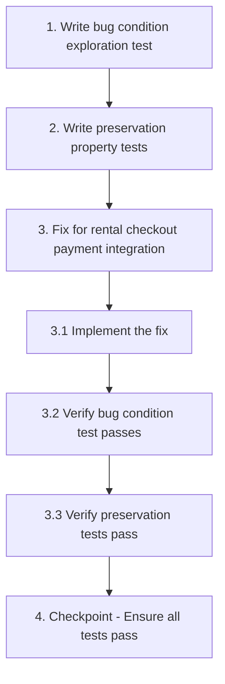

# Implementation Plan

## Overview

This plan addresses the rental checkout payment bug. The rental checkout simulates payment instead of using a real payment provider. The fix will integrate Paystack (the same provider used for room/hall reservations).

## Task Dependency Graph

## Notes

- The fix uses Paystack only (no Flutterwave)
- The rental checkout will follow the same pattern as room/hall checkout in `src/routes/checkout.tsx`
- Bug condition exploration test is expected to FAIL on unfixed code (this confirms the bug exists)

## Tasks

- [x] 1. Write bug condition exploration test
  - **Property 1: Bug Condition** - Rental Payment Simulation Bug
  - **CRITICAL**: This test MUST FAIL on unfixed code - failure confirms the bug exists
  - **DO NOT attempt to fix the test or the code when it fails**
  - **NOTE**: This test encodes the expected behavior - it will validate the fix when it passes after implementation
  - **GOAL**: Surface counterexamples that demonstrate the bug exists
  - **Scoped PBT Approach**: For deterministic bugs, scope the property to the concrete failing case(s) to ensure reproducibility
  - Test implementation details from Bug Condition in design: When user clicks payment button in rental checkout, no actual payment provider API is called
  - The test assertions should match the Expected Behavior Properties from design (real Paystack payment transaction, booking created AFTER payment callback)
  - Run test on UNFIXED code
  - **EXPECTED OUTCOME**: Test FAILS (this is correct - it proves the bug exists)
  - Document counterexamples found to understand root cause
  - Mark task complete when test is written, run, and failure is documented
  - _Requirements: 1.1, 1.2, 1.3_

- [ ] 2. Write preservation property tests (BEFORE implementing fix)
  - **Property 2: Preservation** - Room/Hall Payment Processing
  - **IMPORTANT**: Follow observation-first methodology
  - Observe behavior on UNFIXED code for room/hall checkout path (src/routes/checkout.tsx)
  - Write property-based tests capturing Paystack payment processing behavior that should be preserved
  - Property-based testing generates many test cases for stronger guarantees
  - Test that room/hall checkout continues to use Paystack
  - Test that booking reference generation remains consistent
  - Run tests on UNFIXED code
  - **EXPECTED OUTCOME**: Tests PASS (this confirms baseline behavior to preserve)
  - Mark task complete when tests are written, run, and passing on unfixed code
  - _Requirements: 3.1_

- [ ] 3. Fix for rental checkout payment integration

  - [ ] 3.1 Implement the fix
    - Replace simulated payment delay with real Paystack payment initialization (matching src/routes/checkout.tsx pattern)
    - Use window.PaystackPop.setup() to initialize payment
    - Move booking creation inside payment success callback (not before payment)
    - Add payment failure and cancellation handling
    - Display appropriate error messages for cancelled/failed payments
    - Remove any Flutterwave-related code
    - _Bug_Condition: isBugCondition(input) where rental checkout payment button is clicked without payment provider API call_
    - _Expected_Behavior: Real Paystack payment transaction initiated, booking created only after successful payment callback_
    - _Preservation: Room/hall checkout continues using Paystack; inventory management unchanged; payment calculations unchanged_
    - _Requirements: 2.1, 2.2, 2.3, 3.2, 3.3, 3.4_

  - [ ] 3.2 Verify bug condition exploration test now passes
    - **Property 1: Expected Behavior** - Rental Payment Processing
    - **IMPORTANT**: Re-run the SAME test from task 1 - do NOT write a new test
    - The test from task 1 encodes the expected behavior
    - When this test passes, it confirms the expected behavior is satisfied
    - Run bug condition exploration test from step 1
    - **EXPECTED OUTCOME**: Test PASSES (confirms bug is fixed)
    - _Requirements: 2.1, 2.2, 2.3_

  - [ ] 3.3 Verify preservation tests still pass
    - **Property 2: Preservation** - Room/Hall Payment Processing
    - **IMPORTANT**: Re-run the SAME tests from task 2 - do NOT write new tests
    - Run preservation property tests from step 2
    - **EXPECTED OUTCOME**: Tests PASS (confirms no regressions)
    - Confirm all tests still pass after fix (no regressions)
    - _Requirements: 3.1_

- [ ] 4. Checkpoint - Ensure all tests pass
  - Ensure all tests pass, ask the user if questions arise.